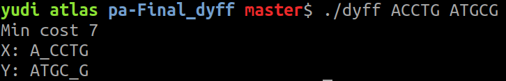

# Dyff: Diff do Yudi

**Número da Lista**: 19

**Conteúdo da Disciplina**: Programação dinâmica

## Alunos
|Matrícula | Aluno |
| -- | -- |
| 16/0149410  |  Yudi Yamane |

## Sobre 
Dyff é um programa de linha de comando que compara duas strings usando o 
algoritmo de Alinhamento de Sequência.

Você pode mudar os custos em [main.cpp](main.cpp).

Use apenas caracteres ASCII.

## Screenshots




## Instalação 
**Linguagem**: C++

Você precisa do g++ na versão 11 instaldo em sua máquina.

## Uso 
É só compilar com

```sh
# certifique-se que o arquivo tem permissão de execução com
chmod +x build.sh
# compile
./build.sh
```

Execute com 

```sh
./dyff "string1" "string2"
```


